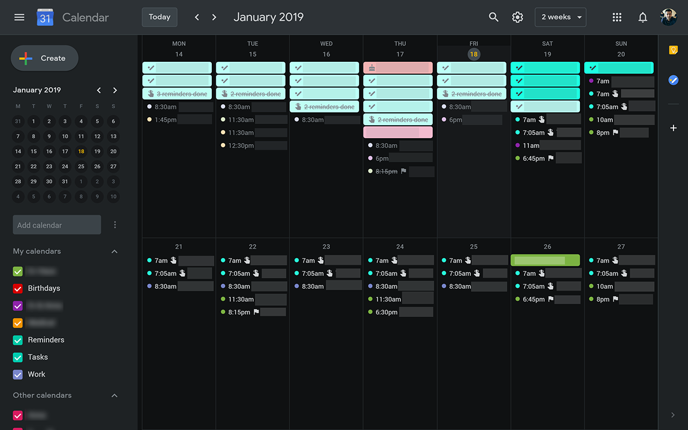

# Google Redesigned

**A complete redesign of popular Google services, Google Redesigned changes the appearance of popular Google services.**

This repository holds the user styles which you can install via your favorite user style browser extension.

## Gmail

### How to Install

#### Firefox

- Install [Stylus](https://addons.mozilla.org/en-US/firefox/addon/styl-us/)
- Go to https://userstyles.org/styles/152198/gmail-redesigned-dark-mode
- Click the "Install" button

#### Chrome

- Install [Stylus](https://chrome.google.com/webstore/detail/stylus/clngdbkpkpeebahjckkjfobafhncgmne?hl=en)
- Go to https://userstyles.org/styles/152198/gmail-redesigned-dark-mode
- Click the "Install" button

----

## Google Calendar

### How to Install

#### Firefox

- Install [Stylus](https://addons.mozilla.org/en-US/firefox/addon/styl-us/)
- Go to https://userstyles.org/styles/7339/google-calendar-redesigned-dark-mode
- Click the "Install" button

#### Chrome

- Install [Stylus](https://chrome.google.com/webstore/detail/stylus/clngdbkpkpeebahjckkjfobafhncgmne?hl=en)
- Go to https://userstyles.org/styles/7339/google-calendar-redesigned-dark-mode
- Click the "Install" button
